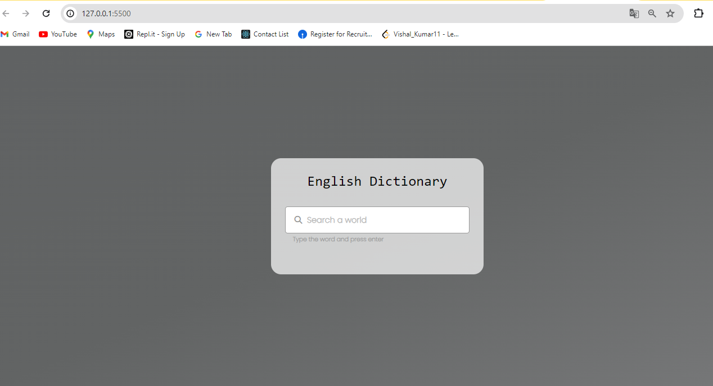
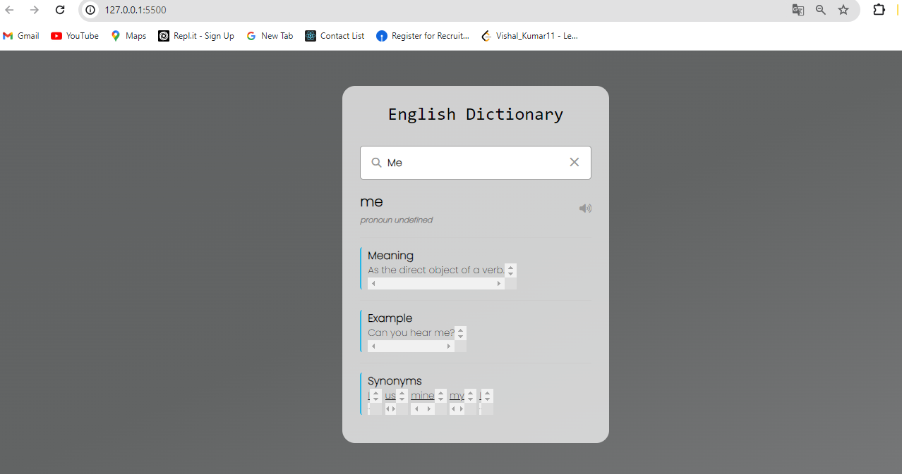

# English Dictionary

This project is a web-based English dictionary application that allows users to search for words and get their meanings, examples, and synonyms.

## Features

- Search for any English word.
- Display the word's meaning, part of speech, and phonetics.
- Provide an example sentence using the word.
- List synonyms for the word.
- Play audio pronunciation of the word.

## Getting Started

### Prerequisites

To view and run this project, you need a web browser with internet access to fetch data from the dictionary API.

### Installation

1. Clone the repository or download the files.
2. Open `index.html` in your web browser.

### Project Structure

- `index.html`: The main HTML file that contains the structure of the dictionary application.
- `styles.css`: The CSS file for styling the application.
- `script.js`: The JavaScript file that contains the logic for fetching data from the dictionary API and updating the UI.

## Usage

1. Open `index.html` in your web browser.
2. Type a word in the search input field and press Enter.
3. The application will display the word's meaning, example sentence, and synonyms.
4. Click on the volume icon to hear the pronunciation of the word.
5. Click on the close icon to clear the search input and reset the application.

## Code Overview

### HTML

The `index.html` file contains:

- A search input field for entering the word to search.
- Icons for search and clear actions.
- Sections to display the word's details, including meaning, example, and synonyms.

### CSS

The `styles.css` file contains the styling for the application, ensuring a clean and user-friendly interface.

### JavaScript

The `script.js` file contains the following functionality:

- Fetches data from the dictionary API using the `fetchAPI` function.
- Validates and processes the fetched data in the `data` function.
- Updates the UI to display the word's details.
- Handles events such as keyup for the search input, click for the volume icon, and click for the clear icon.

### External Libraries

The project uses the following external libraries:

- [Font Awesome](https://cdnjs.cloudflare.com/ajax/libs/font-awesome/6.4.2/css/all.min.css) for icons.
- [Google Material Icons](https://fonts.googleapis.com/icon?family=Material+Icons) for additional icons.

## Contributing

If you would like to contribute to this project, please fork the repository and submit a pull request.

## License

This project is open source and available under the [MIT License](LICENSE).

## Acknowledgements

- This project uses the [Dictionary API](https://dictionaryapi.dev/) for fetching word data.
- Inspired by various online dictionary applications.

## Output Screen

   - #### Before Searching word
   

   - #### After Searching word
   
